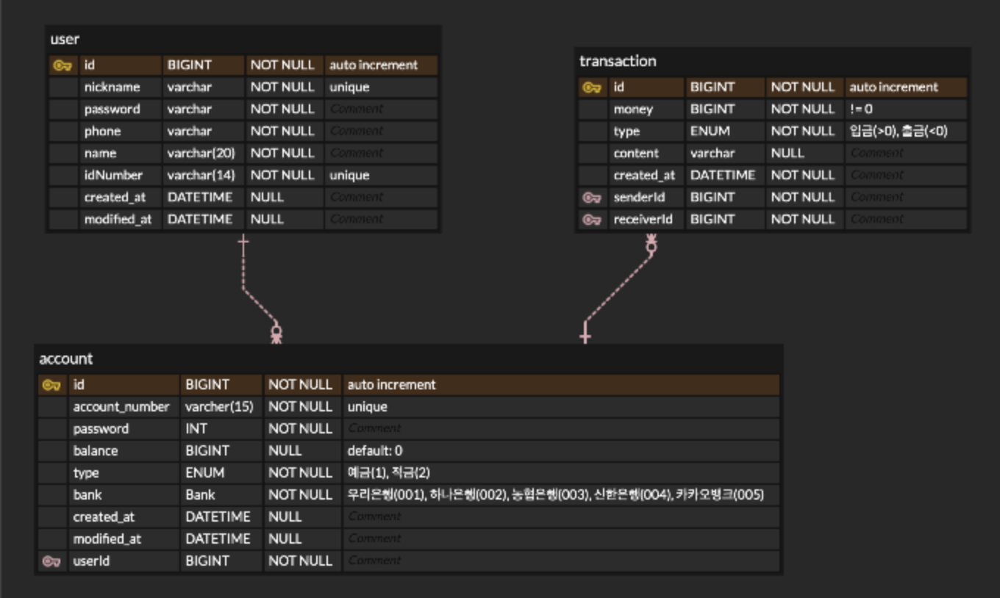

# 💸 Fintech
계좌관리, 송금 등 은행에서 제공하는 서비스

## 개발기간
2023.06.12 ~ 2023.07.17

## 프로젝트 기능 및 설계
### 회원 서버
1. 회원가입
   - 아이디, 비밀번호, 주민등록번호, 휴대폰, 이름 항목 입력
2. 로그인/로그아웃
   - 아이디와 비밀번호로 로그인
   - 토큰 발행(20분 유효)
3. 회원 상세정보
   - 로그인 필수
   - 비밀번호 입력시, 회원정보 출력

### 계좌 서버
1. 생성
    - 로그인 필수
    - 계좌는 1인당 은행별 최대 3개(적금2개, 예금1개) 생성 가능
    - 계좌 비밀번호(숫자 4자리) 생성
    - 계좌번호(13자리), 계좌 생성일, 고객, 잔액 0원 초기화 설정
    
2. 삭제
    - 로그인 필수
    - 사용자가 가진 계좌들 중 계좌번호, 계좌 비밀번호, 생년월일 입력으로 삭제.
    - 단, 계좌 금액이 0원이어야 함.

3. 금액 인출
    - 로그인 필수
    - 금액 존재여부, 계좌유형(적금 불가능) 확인 후, 계좌 비밀번호 입력으로 인출
    
4. 금액 입금
    - 로그인 필수
    
5. 계좌 검색
    - 로그인 필수
    - 계좌번호, 계좌 비밀번호 앞자리 입력으로 계좌 조회
    - 결과: 계좌번호, 잔액, 가입일자, 고객명, 계좌유형
   
### 송금 서버
1. 송금 
    - 로그인 필수
    - 송금자의 계좌유형(적금X), 잔액 확인
    - 수금자의 계좌 존재 여부 확인
    - 송금자의 계좌 비밀번호 일치여부
    - 완료시, 수금자와 송금금액 반환

2. 송금 조회
    - 로그인 필수
    - 자신의 계좌번호 입력하여 입출금 내역 확인

## ERD

## Trouble Shooting
[go to the trouble shooting section](doc/TROUBLE_SHOOTING.md)

## Tech Stack

 
   
   
   
  

###### 참고
로고: [https://simpleicons.org](https://simpleicons.org)
